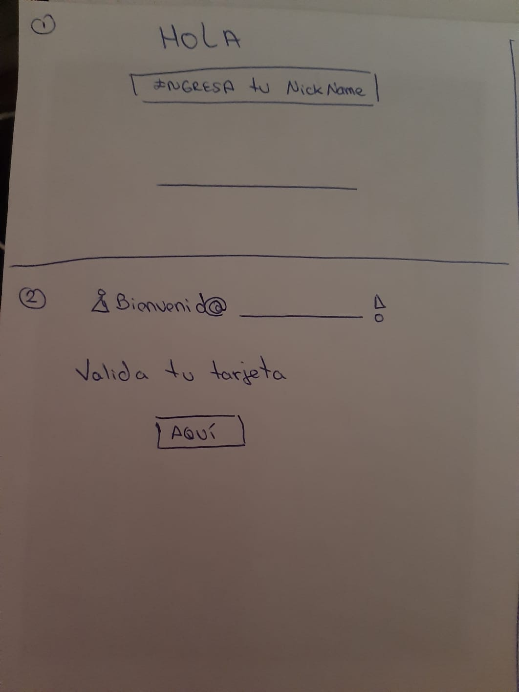
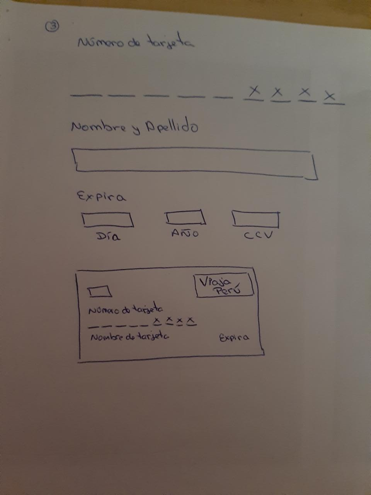
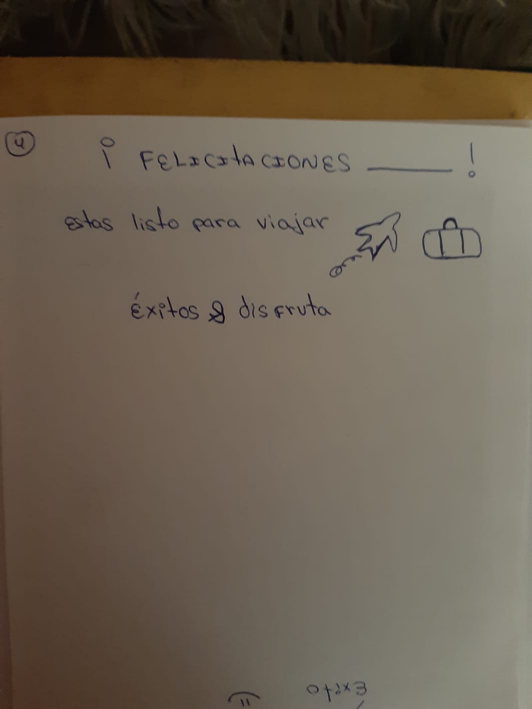
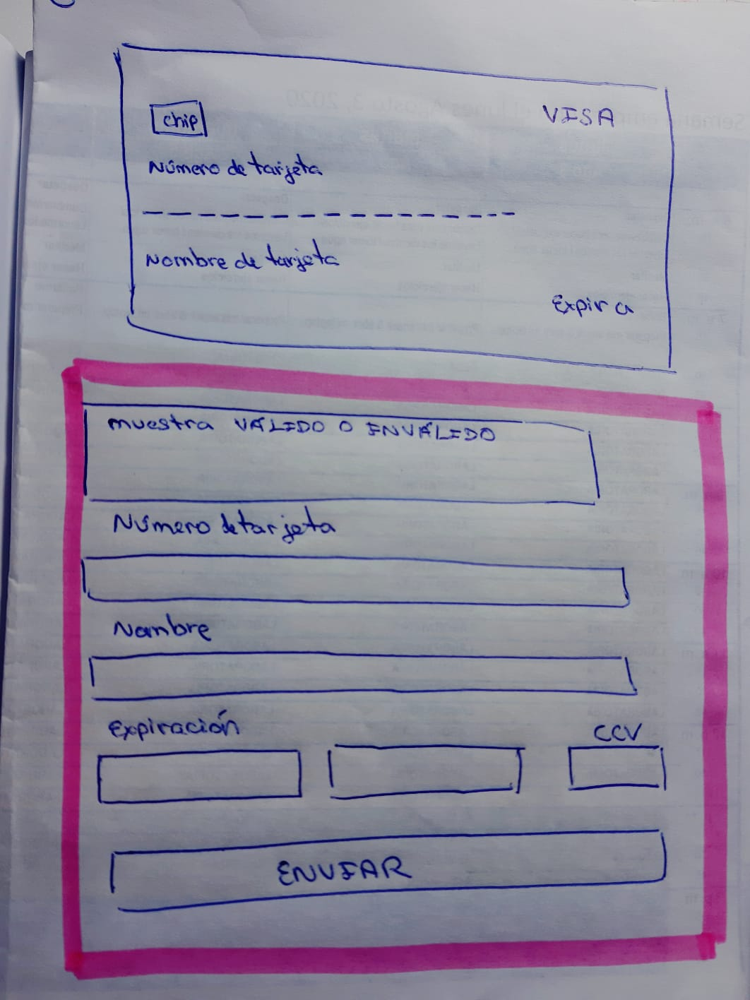
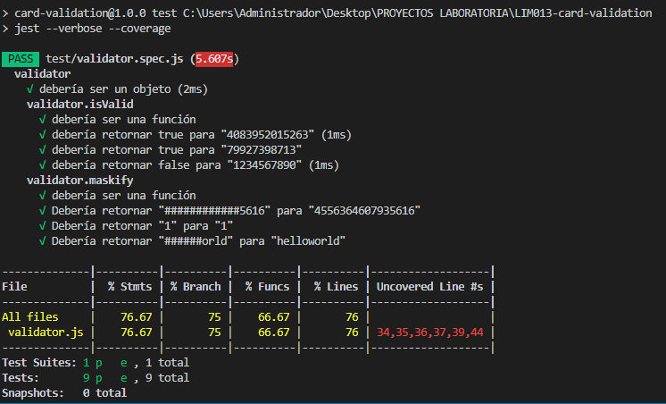

# Tarjeta de crédito válida

## Índice 📝

* 1. Resumen del proyecto
* 2. Manual de uso
* 3. Procedimiento
* 4. Herramientas Usadas
* 5. Fuentes
* 6. Anexos: Testing

***

## 1. Resumen del Proyecto 👨🏼‍💼 👩🏼‍💼
El presente proyecto se ha realizado con la finalidad de crear una página web que permita a los usuarios validar su tarjeta de forma segura y eficaz. 

  ## 1.1 Plannig 👨🏼‍🎓 👩🏼‍🎓
   Usé la herramienta Trello y las dividi por los objetivos del proyecto. 

### 2. Manual de uso 👨🏻‍🚀 👩🏻‍🚀
       * Deberas completar los campos solicitados en el formulario para validar la tarjeta.

       *De resultar inválida tu tarjeta te mostrara un aviso, posteriormente tendras que volver a llenar los campos solicitados. 

### 3. Procedimiento
### 3.1 Público Objetivo
   
    El proyecto ha sido pensado en una tarjeta de viajero para que pueda ser usado en las comunidades indigenas de nuestro Perú en donde se lleva a cabo la practica del Turismo Rural Comunitario(TRC).  En un principio lo usaran las comunidades , para lograr validar la tarjeta del turista, posteriormente se tiene como objetivo que mediante está web las comunidades puedan ofrecer sus productos y/o servicios sin intermediarios y sean ellos quienes puedan recibir los pagos directos vía online de la compra y reservación de su oferta.

   ### 3.2. Prototipo 🔍 
  Primer Prototipo 

 

  ### 3.3. Prototipo + Feedback 🕴🏻

En el presente prototipo he modificado lo siguiente:

*  Usar solo una ventana, para mayor practicidad del usuario.
* Eliminar requisitos previos y realizar una web sencilla , pero eficaz. 
* Se escogieron colores como; el negro por la elegancia que representa e imagen de la comunidad de los Uros , la cual es la comunidad más representativa de lo que respecta al Turismo Rural Comunitario del Perú. 

 🗣 👤 👥 Los aportes fueron brindados por:
 * Coaches
 * Squad 
 * Familiares

### 4. Herramientas Usadas

  ✨ ⚡️Las tecnologías usadas en el presente proyecto fueron: 

 💻 HTML
  
 💻 CSS

 💻 JAVASCRIPT

 💻 Editor de texto Visual Studio Code 

  🌌 Nuevas herramientas usadas en el proyecto fueron: 

  💻 Git 
  💻 Node js.
  💻 GitHub 

### 5. Fuentes

* https://docs.npmjs.com/ 
* https://youtu.be/1eEnboVooiY
* http://www.maestrosdecampo.com/ 
* Diversas herramientas compartidas por los coaches. 

### 6. Anexos: Testing

* [ ] [Testeo unitario.]

